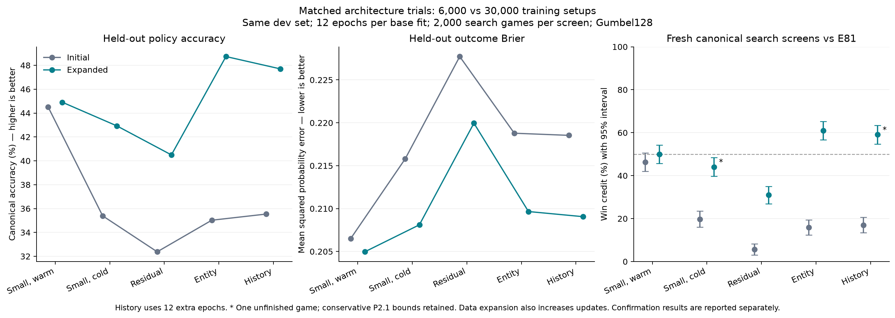

# Architecture pivot study

All required experiments and evaluation stages are complete. E81 remains
the official champion. The expanded
Entity Transformer confirms a canonical Gumbel128 gain against E81: 60.7225%
credit, interval 59.595–61.850%, in 20,000 complete fresh games. Its initial
screen gives 60.975%, and its direct residual screen gives 79.925%. The residual
loses to E81. History comparisons show no established gain over Entity.
At matched native response cost, E81 beats all three large-model recipes.
The evidence supports better Entity encoding at a fixed search budget, not
a simple parameter-capacity bottleneck or a practical gain from naive scaling.
Initial small-data failures remain in the record.
All model and strength tests here use two-player Splendor, the champion's
training and evaluation scope. They do not establish three- or four-player
strength.

The expanded Entity parent is frozen independently at commit
`7367b05ea3a6587bf9c982756027652eeb974990`, branch
`codex/entity-expanded-baseline`. The clean worktree is
`/Users/payton.jones/dev/splendorust-entity-baseline`; its
`research/entity_baseline/HANDOFF.md` records the exact epoch-12 checkpoint,
corpus hashes, training/export code and fresh evaluation commands.
Checkpoint SHA256 is
`cc664b1748ad3f5c704d6fbc471816dcfb59b6a7d7798cef87491468df2fba84`.
The original history study keeps this exact parent and its existing plan.
The freeze passed formatting, strict release Clippy, all 125 release tests,
32-position CPU/Rust export parity and a separate two-game command check.
The frozen baseline retains its original provisional screen. This study adds
fresh confirmation below; E81 remains the official champion.

The user requested a promotion-policy change after the history/E81 screen.
Policy P2.1 allows up to 1% no-action games per stage while retaining every
record and giving unknown outcomes zero candidate credit in the lower bound.
It rejects decision-limit games and invalid evidence. The old decisions are
unchanged; separate reassessments apply the new rule to all retained canonical
screens. This is a registered amendment after a known result. The history
screen now passes under the new rule, with worst-case credit 59.050% and the
same 54.761% lower bound. Its old strict-policy rejection remains intact.
The fresh Entity confirmation below uses this rule; E81 remains the champion. See
[policy amendment](promotion-policy-v2/AMENDMENT.json) and
[preserved-result reassessment](promotion-policy-v2/reanalysis/expanded-history-gate.json).

## Current hypothesis decisions

H1, capacity only: reject this tested recipe as a route to better play. The
4.52M residual fits worse than both small controls and scores 30.975% against
E81 at canonical Gumbel128. Its matched-data loss and direct defeats by Entity
and history give no reason for blind residual scaling. This is one training
seed and one residual recipe; it does not reject all deep residual models.

H2, Entity tokens: support a useful relational architecture under the tested
supervision and fixed search budget. The 4.78M Transformer has better policy
fit than the matched cold small model and residual. Its 20,000-game canonical
confirmation establishes 60.7225% against E81. Its 20,000-game native policy
confirmation establishes 78.735%. Value fit does not beat the warm small
control. Further relational work is promising, but naive parameter growth is
not justified until inference cost and value learning improve.

H3, public history and learned beliefs: no established strength gain from this
recipe. The 4.97M extension scores 46.275% against the retained parent in the
primary canonical screen and 49.150% in the separate base-parent screen.
Opponent prediction improves on a frequency prior, but most accuracy remains
when history is removed. Hidden-card CE is worse than simple public priors.
Beliefs feed policy/value features, not the search's uniform determinizations.
Adding history tokens also changes initial parent predictions. These limits
prevent a general rejection of history or belief-aware planning. The tested
extension gives no basis for further scaling as it stands.

The data expansion improves these new models, but also increases optimizer
updates fivefold at equal epochs. It does not isolate data quantity from
training compute. E81 initialization is a separate advantage in the warm
small control. All strength claims are conditional on two players, the named
E81 opponent, profile, frozen checkpoint and search budget. The completed cost tests below show that E81 remains stronger at similar
measured native response cost. This is a hardware/backend/profile result,
not a proof of optimal efficiency or equal canonical compute. A smaller
Entity model, better value targets or distillation are more promising next
steps than a blind parameter increase. No additional experiments are started.

## Models and data

| Trial | Parameters | Initial training status |
| --- | ---: | --- |
| Small, E81 initialization | 143,470 | 12 epochs complete |
| Small, random initialization | 143,470 | 12 MPS epochs complete; interrupted 11-epoch CPU trial retained |
| Full deep residual, width 512, eight blocks | 4,523,603 | 12 epochs complete |
| Entity Transformer, width 256, six layers, eight heads | 4,780,883 | 12 epochs complete |
| Entity plus public history, opponent and reservation heads | 4,973,746 | 12 additional epochs complete |
| Entity parent continuation | 4,780,883 | 12 additional epochs complete |
| History-only training | 4,973,746 | 12 additional epochs complete |
| State-only auxiliary training | 4,973,746 | 12 additional epochs complete |

The initial corpus has 336,502 training positions from 6,000 games and
111,572 dev positions from 2,000 games. Native/canonical game counts are
5,000/1,000 for training and 1,000/1,000 for dev. Setup IDs are disjoint.
The same public inputs, policy/value targets and data order apply to model
controls. The warm small model starts at E81; the other base models start
from random weights. Equal epochs do not imply equal FLOPs or pretraining.

The residual evaluates its full network at roots and leaves. The Transformer
uses semantic player, bank, market, noble, reservation and deck tokens.
The history extension uses the preceding 16 public events, plus opponent
next-action and hidden-reservation targets. Private simulator state supplies
labels only. Predicted probabilities feed back into policy/value features.
They do not change the search's uniform public determinizations.

All base models run 12 epochs, batch 512, AdamW and cosine decay. New models
start at 3e-4; the warm small model and continuation runs start at 1e-4.
Checkpoints minimize dev policy CE + four times outcome Brier. History
auxiliary loss weights are 0.25 for opponent action and 0.10 for reservations.
Keep all later epochs, including worsening results. See [preregistration](PREREGISTRATION.md).

## Initial held-out fit

| Selected checkpoint | Native policy accuracy | Canonical policy accuracy | Native outcome Brier | Canonical outcome Brier |
| --- | ---: | ---: | ---: | ---: |
| E81 weights in the public small control, before training | 49.16% | 46.46% | 0.20728 | 0.20733 |
| Warm small, epoch 10 | 53.11% | 44.51% | 0.20506 | 0.20650 |
| Cold small, epoch 12 | 42.18% | 35.39% | 0.21418 | 0.21580 |
| Residual, epoch 5 | 39.09% | 32.38% | 0.22819 | 0.22772 |
| Entity, epoch 8 | 41.99% | 35.02% | 0.21775 | 0.21879 |
| History and auxiliaries, epoch 1 | 42.31% | 35.54% | 0.21745 | 0.21854 |

The initial residual and entity runs overfit: train loss falls while dev error
rises. The entity fits better than the residual, but does not beat the cold
small control. E81's pretraining is a material confound in comparisons with
new models trained from scratch.
The first fit row evaluates E81 weights through the common public-input
control. It is not a separate measurement of the champion's live search.
Playing-strength rows compare against the actual frozen champion agent.

The selected history checkpoint predicts the opponent's next action with
15.74% native and 13.27% canonical accuracy. Its hidden-reservation CE is
3.132/3.153, worse than the legal-pool uniform baseline, 3.076/3.077. These
figures do not show useful learned beliefs. Later epochs worsen dev error.
The train-only action-frequency baseline scores 7.65%/7.54% accuracy and
3.629/3.558 CE; the opponent head scores 3.110/3.166 CE. It learns some
opponent-action information. Train-only card frequencies constrained by the
public pool and tier score hidden CE 3.061/3.091, also better than the learned
head. See [auxiliary baselines](auxiliary-baselines.json).
Compare the full run with equal-budget parent continuation, history-only
training, state-only auxiliary training and same-weight no-history inference.
All initial comparisons are complete; their intervals include equal strength.

All three initial training controls and their native tests are complete. The
canonical history/parent test also completes all 2,000 games, with no
unfinished games. Its 51.0% credit does not establish a history gain.

[Result catalog](result-catalog.json) records selected metrics, completed
and planned epochs, checkpoint hashes, raw result hashes and costs. It marks
partial training runs explicitly and includes only finished strength runs.

## Expanded held-out fit

| Selected checkpoint | Native policy accuracy | Canonical policy accuracy | Native outcome Brier | Canonical outcome Brier |
| --- | ---: | ---: | ---: | ---: |
| Warm small, epoch 12 | 53.89% | 44.91% | 0.20400 | 0.20496 |
| Cold small, epoch 12 | 52.29% | 42.93% | 0.20620 | 0.20811 |
| Residual, epoch 9 | 48.02% | 40.50% | 0.21633 | 0.21996 |
| Entity, epoch 12 | 57.50% | 48.73% | 0.20760 | 0.20966 |
| History, epoch 1 after 12 extra epochs | 57.09% | 47.70% | 0.20981 | 0.20906 |

The expanded warm run completes all 12 epochs in 2,130.84 seconds under
shared load. Its selected score is 2.36582, versus 2.39357 on initial data.
These are modest fit gains. Completed strength screens appear below.
Cold small completes 12 epochs in 2,144.70 seconds and residual
in 1,990.44 seconds. Their selected scores are 2.43496 and 2.60104. Both
improve on initial data, but the residual still has worse policy and value
fit than the cold small control. Entity completes all 12 epochs in 8,990.50
seconds, selecting epoch 12 with score 2.22212. It improves policy fit over
both small controls and the residual. Its value error remains above the warm
small control. Its search gain is confirmed below on fresh 20,000 games.
Equal epochs on the expanded corpus also mean more updates; this comparison
does not isolate data size from training compute.

The figure shows completed 2,000-game screens. Confirmation runs are reported separately below. See [figure receipt](architecture-figure.json).

## Expanded playing strength

These tests use the same registered setup stream against E81. All native
rows have 2,000 complete policy-only games. Canonical rows use Gumbel128
for both agents. Timing for these early tests overlaps entity training.

| Candidate / E81 | Profile | Credit | 95% interval | Complete / unfinished |
| --- | --- | ---: | ---: | ---: |
| Warm small | Native, policy only | 51.200% | 46.819–55.581% | 2,000 / 0 |
| Cold small | Native, policy only | 50.350% | 46.027–54.673% | 2,000 / 0 |
| Residual | Native, policy only | 48.075% | 43.741–52.409% | 2,000 / 0 |
| Entity | Native, policy only | 78.275% | 74.588–81.962% | 2,000 / 0 |
| Entity / residual | Native, policy only | 79.650% | 76.041–83.259% | 2,000 / 0 |
| Entity / cold small | Native, policy only | 78.875% | 75.154–82.596% | 2,000 / 0 |
| History and auxiliaries | Native, policy only | 77.725% | 73.904–81.546% | 2,000 / 0 |
| History / early-stopped Entity parent | Native, policy only | 50.325% | 46.029–54.621% | 2,000 / 0 |
| History / same weights with history removed | Native, policy only | 50.975% | 47.136–54.814% | 2,000 / 0 |
| Warm small | Canonical, Gumbel128 | 49.925% | 45.678–54.172% | 2,000 / 0 |
| Cold small | Canonical, Gumbel128 | 44.047% | 39.670–48.434% | 1,999 / 1 |
| Residual | Canonical, Gumbel128 | 30.975% | 26.909–35.041% | 2,000 / 0 |
| Entity | Canonical, Gumbel128 | 60.975% | 56.727–65.223% | 2,000 / 0 |
| Entity / residual | Canonical, Gumbel128 | 79.925% | 76.236–83.614% | 2,000 / 0 |
| Entity / cold small | Canonical, Gumbel128 | 66.200% | 62.014–70.386% | 2,000 / 0 |
| History and auxiliaries | Canonical, Gumbel128 | 59.080% | 54.761–63.385% | 1,999 / 1 |
| History / early-stopped Entity parent | Canonical, Gumbel128 | 46.275% | 42.044–50.506% | 2,000 / 0 |
| History / base Entity | Canonical, Gumbel128 | 49.150% | 44.823–53.477% | 2,000 / 0 |
| History / residual | Canonical, Gumbel128 | 75.275% | 71.392–79.158% | 2,000 / 0 |
| History / base Entity | Native, policy only | 48.850% | 44.579–53.121% | 2,000 / 0 |
| History / residual | Native, policy only | 77.175% | 73.338–81.012% | 2,000 / 0 |
| Entity / E81, fresh confirmation | Native, policy only | 78.735% | 77.780–79.690% | 20,000 / 0 |
| Entity / E81, fresh confirmation | Canonical, Gumbel128 | 60.7225% | 59.595–61.850% | 20,000 / 0 |

Cold small has one `no_legal_action` game: block 22, rotation 0, setup
5632998434229486229. It has no winner. Its old strict gate rejects it;
P2.1 permits completion accounting, but its strength still fails promotion. Its displayed
credit uses completed games, as stored by the arena; the interval includes
worst-case unfinished credit. All raw records remain in the result set.
Warm small has no established search gain. Its close result qualifies for
possible milestone confirmation under the fixed rule after all models finish.
The residual improves from 5.625% on initial data to 30.975% here, but still
loses clearly to E81. Its full 4.52M parameters do not produce a strength
gain in this recipe. Native policy strength must not be read as canonical
search strength.

The expanded entity has a clear native policy-only gain over E81. Its
canonical Gumbel128 screen also shows a clear gain over E81: 60.975%
credit, interval 56.727–65.223%, all 2,000 games complete. Its direct canonical
test against the residual gives 79.925%, interval 76.236–83.614%, all 2,000
games complete. Its direct cold-small test gives 66.200%, interval
62.014–70.386%, all 2,000 games complete. The registered rule selects the
Entity Transformer for the history extension. It also has clear direct native gains
over the residual and cold small control. The native milestone confirmation completed 20,000 disjoint paired games,
master 5250000000: credit 78.735%, interval 77.780–79.690%, no unfinished games.
Runtime was 754.12 seconds under shared load; this native result does not
confirm canonical search strength. See
[native confirmation](expanded-native-entity-confirmation/summary.json). All four base
exports pass actual-checkpoint parity on 32 real dev positions: maximum
logit errors are 1.907e-5 / 2.289e-5 / 2.480e-5 / 9.537e-6 for warm, cold,
residual and entity; maximum masked policy/value error is 3.934e-6. The
expanded entity service is bit-identical across tested occupancies. These
checks do not claim identical Rust/Torch whole-game trajectories.

The selected expanded history model completes its native E81 screen with
77.725% credit, versus the Entity parent's 78.275% on the same master.
This establishes a native gain over E81, but not a history gain over Entity.
The direct parent screen gives 50.325%, interval 46.029–54.621%, all 2,000
games complete. It establishes no native policy gain over the retained parent.
The same-weight no-history screen gives 50.975%, interval 47.136–54.814%,
all 2,000 games complete. It establishes no benefit from history at native
policy inference. The canonical E81 screen gives 59.080% among completed
games, interval 54.761–63.385%, with 1,999 complete and one unfinished game.
Block 14, rotation 1, setup 191495341089502720 has `no_legal_action` and no
winner. The interval includes worst-case unfinished credit; promotion rejects
this incomplete run under the old rule. P2.1 separately accepts it using
59.050% worst-case credit over all 2,000 requested games and the unchanged
54.761% lower bound; no outcome or original decision is rewritten.
Its 2,710.05 seconds are shared-host timing. This screen
does not establish a history gain over the Entity parent. The direct canonical
parent test is complete: 46.275%, interval 42.044–50.506%, all 2,000
games complete, master 5180040000. The separate base-Entity test gives
49.150%, interval 44.823–53.477%, master 5180080000. Neither establishes
a history gain. The primary parent interval excludes a one-point gain under
this recipe; it does not reject all possible history architectures. Expanded
history-only and state-only auxiliary fits are not triggered by the registered
rule. Initial attribution fits and all their negative results remain preserved. See [raw decision](expanded-history-gate/decision.json).
Actual-checkpoint history export parity on 32 real dev prefixes gives
maximum logit error 1.240e-5 and masked-policy/value error 2.503e-6.
The fixed-batch history service is bit-identical across tested occupancies.
The probe gives 2,160 calls/s at 32 clients under its stated shared-host scope;
whole-game scaling and refined cost matching are complete.

## Expanded history fit and controls

The registered rule selects the Entity Transformer as the parent. The history
extension has 4,973,746 parameters and uses version 2 public events. Before
training, its dev selection score is 2.30432, versus the parent's 2.22212.
Inherited weights do not preserve the parent's outputs when the added history
tokens enter attention. All 12 additional epochs are complete in 13,980.11
seconds. The selected checkpoint is epoch 1; every later epoch has worse
main dev error while train loss falls. Keep the initial measurement and full curve.
Compare the selected checkpoint with the retained parent and same-weight
no-history inference. The user stopped the expanded parent continuation
early, as recorded below; it is not a completed equal-budget training control.

The selected epoch completes in 1,215.73 seconds. Its dev score is 2.25386, still worse
than the base parent's 2.22212. Opponent-action accuracy is 27.57% native and
23.49% canonical, with CE 2.480/2.652. The expanded train-frequency baseline
has 7.65%/7.54% accuracy and CE 3.629/3.557. Hidden-card CE is 3.103/3.130,
worse than uniform 3.076/3.077 and train-frequency 3.059/3.062. These are
selected-checkpoint fit results, not playing-strength evidence. The parent
continuation was stopped; canonical strength tests show no established
benefit over its selected parent. See
[expanded auxiliary baselines](expanded-auxiliary-baselines.json).

The user stopped the expanded parent continuation after 10 completed epochs,
during epoch 11, because no dev improvement appeared. All 10 scores worsen
from the initial 2.22212, reaching 2.54272 at epoch 10. The selected parent
remains epoch 0; all 81 state tensors and 4,780,883 parameter elements match
the frozen Entity weights bit for bit. The original manifest and latest
completed checkpoint remain intact. This is an early-stopped parent control,
not a completed 12-epoch equal-budget fit. The full history model completed
12 additional epochs and selected epoch 1 under the same dev rule. Registered
strength seeds, budgets and later stages remain fixed. See
[early-stop receipt](expanded-entity-continuation/early-stop.json) and
[evaluation resumption](expanded-study/early-stop-resumption.json).

The opponent target is the first later opponent action after the current
observation. The current actor's next choice is not supplied to the model.
Hidden-card targets describe occupied opponent blind slots at that observation.
Replay ground truth enters the loss and scoring only. Version 2 history keeps
the public action index and slot coordinates as well as public token/card changes.
All 1,793,594 train/dev positions pass the prefix and public-pool audit; the
466,745 occupied hidden-slot targets include repeated positions within games.
They are not 466,745 independent blind draws. An added CPU diagnostic checks
the selected checkpoint against frequency and uniform baselines with a
10,000-resample bootstrap over independent game setups. It does not select
weights or search budgets and does not replace fresh playing-strength tests.

The CPU diagnostic reproduces all selected auxiliary metrics within 2e-5.
Each profile has 1,000 independent dev setups. It scores 54,926/54,646 next
opponent actions and 13,098/18,975 occupied hidden slots, respectively.

| Selected history model | Native | Canonical |
| --- | ---: | ---: |
| Opponent CE minus train-frequency CE, 95% setup bootstrap | -1.1486 [-1.1583, -1.1391] | -0.9053 [-0.9158, -0.8947] |
| Hidden CE minus uniform CE, 95% setup bootstrap | +0.0273 [+0.0059, +0.0488] | +0.0537 [+0.0356, +0.0718] |
| Hidden CE minus train-frequency CE, 95% setup bootstrap | +0.0447 [+0.0280, +0.0620] | +0.0682 [+0.0537, +0.0829] |
| Opponent accuracy, full / zero history, same weights | 27.57% / 27.29% | 23.49% / 23.36% |
| Hidden CE, full / zero history, same weights | 3.10328 / 3.10360 | 3.13027 / 3.13009 |

Lower CE is better. The opponent head beats an unconditional marginal
predictor, but most of that gain survives removal of history. The hidden
head is worse than uniform and frequency priors on this fixed dev split.
The small full-versus-zero differences are descriptive; no significance
claim is made for them. Removing history at inference is not a separate
training control. These exploratory dev results do not replace canonical
strength confirmation or the registered conditional attribution tests.
See [checkpoint and setup-bootstrap receipt](expanded-history/auxiliary-diagnostics.json).

## Initial playing strength

Each row below has 2,000 fresh seat-paired games. Shared wins receive fractional
credit. Intervals come from independent setup blocks. Every completed native
match is replayed and each action is checked against the legal set.

| Candidate / opponent | Profile and search | Candidate credit | 95% interval | Status |
| --- | --- | ---: | ---: | --- |
| Warm small / E81 | Canonical, Gumbel 128 both | 46.300% | 42.008–50.592% | No supported gain |
| Cold small / E81 | Canonical, Gumbel 128 both | 19.750% | 16.026–23.474% | Clear loss |
| Residual / E81 | Canonical, Gumbel 128 both | 5.625% | 3.055–8.195% | Clear loss |
| Entity / E81 | Canonical, Gumbel 128 both | 15.850% | 12.340–19.360% | Clear loss |
| History / E81 | Canonical, Gumbel 128 both | 17.025% | 13.410–20.640% | Clear loss |
| History / equal-budget parent continuation | Canonical, Gumbel 128 both | 51.000% | 46.796–55.204% | No established difference |
| Residual / E81 | Native, policy only | 20.325% | 16.640–24.010% | Clear loss |
| Entity / E81 | Native, policy only | 25.050% | 21.063–29.037% | Clear loss |
| Cold small / E81 | Native, policy only | 22.900% | 19.117–26.683% | Clear loss |
| Entity / residual | Native, policy only | 56.575% | 52.242–60.908% | Entity beats this residual checkpoint |
| Entity / cold small | Native, policy only | 47.825% | 43.486–52.164% | No established difference |
| History / E81 | Native, policy only | 23.300% | 19.550–27.050% | Clear loss |
| History / entity parent | Native, policy only | 48.375% | 44.149–52.601% | No established difference |
| History / residual | Native, policy only | 54.175% | 49.828–58.522% | No established difference |
| History / same weights with no history input | Native, policy only | 51.475% | 47.709–55.241% | No established difference |
| History / equal-budget parent continuation | Native, policy only | 51.850% | 47.667–56.033% | No established difference |
| History / history-only training | Native, policy only | 50.925% | 46.752–55.098% | No established difference |
| History / state-only auxiliary training | Native, policy only | 50.750% | 46.997–54.503% | No established difference |

Canonical rows use depth 16, world pool 3 and the fixed search settings.
Promotion screens use scripts/promote.py and retain E81. The native profile
includes its own score-cap termination rule. Native completion is not a
canonical victory. Do not infer a canonical ranking from native rows.
The initial entity/E81 and residual/E81 policy screens requested 14 workers,
but ten 200-game shards allowed at most ten active workers. Later screens
use 100-game shards so all 14 workers can be active.

H1 fails for the initial residual checkpoint and recipe. This does not reject
all residual architectures or larger-data training. H2 is supported relative
to this residual checkpoint, but has no established gain over a matched cold
small model. H3 has no established gain in the initial native games; its
expanded-data tests also show no established history gain over the parent. The initial canonical direct test also
has no established gain. No result establishes a
fundamental capacity limit.

## Data expansion and provenance

Collect 20,000 extra native expert games with the unchanged AlphaZero800
teacher, master 5110000000. Add 4,000 canonical Gumbel800 games on disjoint
seeds. The expanded train set contains 30,000 games and about 1.7 million
positions. The original dev set is retained. All base architectures and both
small initialization controls have completed training on these matched rows.
Report distinct games, blind draws and policy diversity; repeated positions
are not independent evidence.

The collected policy targets are single expert actions: mean row entropy is
zero and every row has one positive target. Expansion covers all 81 native
action indices, versus 78 initially, and 60 canonical indices, versus 59.
There are 296,398 native and 75,083 canonical training positions with an
opponent blind reservation. They supply 434,672 occupied-slot targets; these
are repeated observations, not distinct blind draws. Dev supplies another
32,073 occupied-slot targets. See [corpus summary](data-summary.json).
Expanded training contains 57,513 native and 15,687 canonical blind-draw
actions; dev contains 2,216 and 3,200. Counts use executed action labels and
the first public event of each game. Canonical opening sampling can execute
a different action from the stored expert policy target. Counting policy
argmax alone would miss 75 training blind draws and three dev blind draws.

The extra native collection is complete: 20,000 games and 1,122,834 positions.
Every collected game passes replay validation. The expanded training corpus
has 1,682,022 positions from 30,000 distinct setups, with 25,000 native and
5,000 canonical games. Dev stays at 111,572 positions from 2,000 disjoint
setups. Its version 1 history audit passes all 1,793,594 positions and
466,745 hidden targets. All four expanded base fits are complete. The latest
phase is in [status](STATUS.json).

The expanded history trial uses encoding version 2. Version 1 omitted the
public action index and selected reservation slot. Version 2 adds these two
public fields. It still omits all card attributes for blind draws. Keep the
version 1 data, checkpoints, exports and results separate. Canonical replay
must reproduce the original policy/value rows, public context and auxiliary
labels byte for byte before version 2 history enters training. The new event
encoding passes 3,552 viewer checks over 1,776 transitions, including 150
blind events; Rust and offline tensors match bit for bit. See
[version 2 event parity](public-event-v2-parity.json).
Preparation is complete for the initial corpus and all four extra canonical
shards. Every canonical replay has the same state, policy, value, context and
auxiliary bytes as its original shard. The initial version 2 prefix audit
passes all 448,074 positions and 116,564 hidden targets. See
[version 2 initial validation](history-v2-initial-validation.json).
The expanded version 2 audit is now complete. It passes all 1,793,594
positions and 466,745 hidden targets across 136 groups. Every prefix is
past-only; blind-card attributes stay absent; ground targets remain within
the legal pool and tier. See [full version 2 audit](history-v2-validation.json).

The history runner can also extend the residual if it wins the registered
base comparison. That extension has 8,318,898 parameters and four history
attention layers. Zero projections preserve the residual parent's initial
outputs bit for bit on CPU and MPS. Public pool/tier masks and history
gradients pass checks. Its bridge has maximum logit error 4.768e-6 and
policy/value error 1.192e-6 on 32 real prefixes, with bit-identical outputs
across tested queue occupancies. These are untrained infrastructure checks,
not another fit or strength result. See
[residual history infrastructure](capacity-history-infrastructure.json) and
[runtime pilot](capacity-history-runtime-pilot.json).

Native collection resumes from checked shard hashes. Partial interrupted
shards are archived before rerunning their exact seeds. Canonical collection
is complete. A Cargo test build replaced its original example executable;
the recorded original binary was recovered and frozen. Both affected shards
were rerun. All five files from the repeated complete 1,000-game shard match
the archived files byte for byte. See [recovery parity](canonical-expansion/recovery-parity.json).
No mixed-executable shard enters expanded training. A separate 128-game E81
check has identical ordered records and trajectory hashes between old and
new source versions; see [baseline parity](baseline-trajectory-parity.json).
A further 128-game E81 check gives the same ordered records and trajectory
hashes after the version 2 history code. See
[version 2 baseline parity](baseline-v2-trajectory-parity.json).

## Inference, cost and validation

Similar parameter counts do not imply similar forward compute. A count from
the selected weights estimates 4.51M dense multiply-accumulates per residual
position, 149.63M for Entity's 31 tokens and 229.27M for history's 47 tokens.
Thus, Entity uses about 33.2 times this residual's dense arithmetic per
position; history uses about 1.53 times Entity's. These are operation-count
estimates, not measured latency or energy. They exclude activation, normalization,
input encoding, transport, queueing, search and training gradients. Batch-32
services compute all 32 padded positions even at lower occupancy. Actual
whole-game scaling and refined cost results appear below. See
[weight-bound compute estimate](estimated-compute.json).

The full residual Rust export has maximum logit error 5.722e-6 and masked
policy/value error 1.252e-6 over 512 native and canonical positions. The
history service has errors 8.106e-6 and 1.609e-6 over 32 actual dev prefixes.
Same-weight no-history export also passes. These are numerical tolerances,
not bit-identical Rust/Torch trajectory claims.

Entity and history services accept fixed public tensors only. Each connection
checks the frozen checkpoint SHA256. No setup ID, real deck order, simulator
state or private label enters the service. Fixed padded batches of 32 give
bit-identical outputs across 1, 4, 8, 14 and 32 client occupancies. The history
probe measures about 35/134/254/509/939 calls per second under shared load;
this includes queue and socket costs, and is not whole-game throughput.

A fixed-batch-16 pilot checks 192 native/canonical positions against batch 32.
Entity outputs differ by up to 5.722e-6; history outputs are bit-identical on
these positions. Keep the registered batch-32 backend for the matched trials.
No speed gain or whole-game parity is claimed for the unselected pilot. See
[batch shape parity](batch-shape-parity.json).

A 32-game check covers 1,776 native transitions and both viewers. Offline
and Rust public event/pool tensors are float32 bit-identical. All 150 blind
draw event checks omit card identity. The stricter prefix/label audit covers
448,074 positions and 116,564 hidden targets, with no future/current-action
input, hidden-identity input, tier mismatch or target outside the legal pool.
See [event parity](public-event-parity.json) and history validation receipts.

Initial training costs are 378.58 seconds for warm small, 1,247.96 seconds
for cold small, 276.21 seconds for residual, 2,356.08 seconds for entity, and
4,187.85 seconds for history plus auxiliaries. These runs have different
shared loads and initialization. They are measured run costs, not isolated
architecture speed ratios. The history training sample has about 9.5 GB
physical footprint. The completed residual canonical screen takes 1,614.89
seconds; the warm small screen takes 151.68 seconds. Further whole-game
scaling and refined cost-matched strength measurements are complete.

A CPU-only inference pilot measures the frozen initial entity model. Direct
batch-32 forward rates are about 1,139/2,095/2,426/1,898 positions per second
with 1/4/8/14 Torch threads. The CPU tensor-service probe gives about 57/229/
457/717/1,126 calls per second with 1/4/8/14/32 clients. Its outputs are
bit-identical across tested queue occupancies. The earlier MPS probe gives
about 1,135 calls per second at 32 clients, under a different shared load.
There is no clear transport gain at the registered worker count. Keep MPS;
these pilots do not establish whole-game backend parity or strength. See
[CPU forward pilot](cpu-forward-pilot.json) and
[CPU service probe](entity-cpu-service-probe.json).

A worker pilot compares 14 and 32 game workers using the same frozen models
and padded batch size. All ordered records and trajectory hashes match in
128 policy-only games and 32 Gumbel128 games. Full-search time is 297.80 versus
155.29 seconds under shared load. This supports 32 workers for later canonical
screens. It is not an isolated speed claim or a strength result. The initial
14-worker screen completed with its original settings. Final policy-only
scaling measured 1, 4, 8, 14 and 32 workers. Native strength and cost trials
keep 14 workers.
See [worker pilot](worker-scaling/complete.json).

All six models complete the final 128-game canonical policy-only scaling
stream, master 5170000000. Each model has identical ordered records and
trajectory hashes across all five worker counts. Different models can have
different trajectories. The following are short shared-host measurements,
not stable isolated production rates.

| Model | 1 worker | 4 workers | 8 workers | 14 workers | 32 workers |
| --- | ---: | ---: | ---: | ---: | ---: |
| E81 | 479.7 | 1750.1 | 3236.4 | 4263.7 | 4237.3 |
| Warm small | 470.9 | 1693.4 | 3269.6 | 4290.8 | 4184.3 |
| Cold small | 472.8 | 1743.2 | 3186.0 | 4266.3 | 4297.7 |
| Residual | 35.3 | 138.6 | 263.9 | 376.3 | 363.3 |
| Entity | 3.7 | 14.4 | 28.2 | 48.2 | 120.5 |
| History | 3.5 | 13.5 | 26.7 | 44.6 | 118.0 |

Rates are games per second. Entity/history benefit from occupancy above four
workers; E81 and residual plateau near 14. See
[scaling receipt](cost-study/scaling-summary.json).

The first native cost screens are complete, but all miss the registered
20% response-time matching tolerance. They are approximate budget comparisons,
not matched-cost claims. Response time includes inference transport and queueing;
it is the per-agent mean over its actual decision count, not elapsed match time.

| Model / E81 | Search iterations | Credit | 95% interval | Actual response-cost ratio |
| --- | --- | ---: | ---: | ---: |
| Residual | 8 / 128 | 18.325% | 14.773–21.877% | 1.659 |
| Entity | 0 / 256 | 35.025% | 30.898–39.152% | 1.463 |
| History | 0 / 512 | 29.350% | 25.281–33.419% | 0.763 |

All have 2,000 complete native games. Masters are 5172000000, 5172010000,
and 5172020000. See [original cost receipt](cost-study/cost-strength-summary.json).
A registered finer timing-only grid uses residual budgets 4/5/6 against E81
128 and Entity/history policy-only against E81 320/384/448. It selects on
cost only and then runs fresh 2,000-game strength screens. The first refinement
failed after one retained 128-game pilot because its parser used the wrong
binary-hash field. That pilot is excluded from selection. The corrected run
has separate fresh masters and waits for canonical confirmation to finish;
no active match was stopped. See [corrected plan](cost-refinement-v2/PLAN.json)
and [preserved failure](cost-refinement/failure.json).

The corrected refinement is complete. All three actual response-cost ratios
fall within the registered 20% tolerance. Each budget pair was selected using
128-game timing-only pilots, then tested on 2,000 fresh complete games. Pilot
strength did not enter selection. The following rates include inference,
transport and queue time on this shared host; they are not equal energy or
hardware-normalized FLOP comparisons.

| Model / E81 | Search iterations | Credit | 95% interval | Mean response, candidate / E81 | Cost ratio |
| --- | --- | ---: | ---: | --- | ---: |
| Residual | 4 / 128 | 14.575% | 11.144–18.006% | 6.307 / 6.762 ms | 0.933 |
| Entity | 0 / 320 | 34.750% | 30.638–38.862% | 15.311 / 17.691 ms | 0.865 |
| History | 0 / 384 | 32.500% | 28.443–36.557% | 18.289 / 22.191 ms | 0.824 |

Masters are 5380000000, 5380100000 and 5380200000. Match times are 119.66,
208.80 and 244.11 seconds. See [refined cost receipt](cost-refinement-v2/summary.json).
All three clearly lose to E81 in this native profile at similar response cost.
The different search allocations are part of this comparison. It does not
establish a matched-cost canonical ranking. It does show that equal Gumbel
iteration counts alone conceal a substantial current implementation cost.

The registered history attribution trigger is false in both profiles.
The direct matrix and diagnostics are complete. A fresh canonical Entity/E81
screen passed under P2.1 at master 5220300000: 1,999 complete and one
no-action game, conservative credit 61.800%, interval 57.526–66.126%.
The disjoint 20,000-game milestone confirmation completes at master
6220300000: 60.7225% credit, interval 59.595–61.850%, no unfinished games.
Runtime is 20,693.13 seconds (5.75 hours) under shared host activity. The
registered gate returns `promote`, conditional on this opponent and fixed
Gumbel128 budget. It does not enforce an inference-cost floor and does not
change the champion pointer. See
[confirmed decision](expanded-entity-confirmation/decision.json). All controllers preserve raw decisions
and failures; none changes the champion automatically.

Current format, strict release Clippy and release workspace tests pass.
Python architecture/history tests pass. Engine rules, RNG, replay version,
champion files and disabled GitHub Actions remain unchanged. Expanded fits,
direct strength comparisons, history diagnostics and scaling are complete.
All required training, direct comparisons, conditional attribution decisions,
diagnostics, cost tests and confirmations are finished. The selected expanded
weights and source are committed. `ARTIFACTS.json` inventories retained raw
records, binaries, later checkpoints, logs and failed runs by path, size and
SHA256; ignored files remain on disk. `CHECKPOINTS.json` records the five
selected checkpoint hashes. The corpus registry is `TRAINING_CORPUS.json`.
